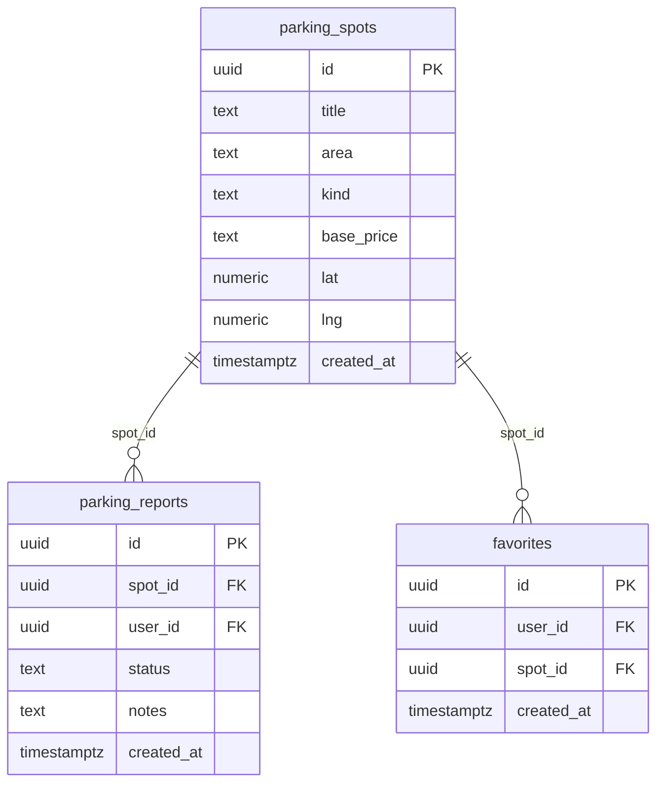

# ParkMe 🅿️

אפליקציית React למציאה, דיווח ושיתוף של חניות פנויות ברחוב בזמן אמת. נהגים שמתפנים מדווחים על המקום, וכל השאר רואים על המפה מה פנוי עכשיו לפני שהם מסתובבים לחפש.

**Live Demo:** _יתעדכן אחרי העלייה ל-Vercel_
**GitHub:** [github.com/shirdror/parkme-react](https://github.com/shirdror/parkme-react)

---

## הבעיה

חיפוש חניה בעיר הוא בזבוז זמן ודלק - מסתובבים בין הרחובות בלי לדעת איפה יש מקום. ParkMe פותרת את זה בדיווח חברתי: מי שמתפנה מחניה מסמן אותה, וכל נהג אחר רואה על מפה חיה איפה יש מקום פנוי, בתשלום או תפוס - עוד לפני שהוא מגיע לאזור.

## קהל יעד

- **נהגים עירוניים** שמבזבזים זמן בחיפוש חניה ורוצים לדעת מה פנוי בקרבתם
- **תושבי אזורים צפופים** שרוצים לשתף ולקבל עדכונים על התפנות חניות ברחוב שלהם

---

## מתחרים וחלופות

| שירות | מה הוא עושה | מה חסר בו לעומת ParkMe |
|---|---|---|
| Waze / Google Maps | ניווט ועומסי תנועה | לא מראים אילו חניות רחוב פנויות ממש עכשיו |
| Pango / Cellopark | תשלום על חניה | אפליקציות תשלום, לא איתור מקום פנוי |
| חניונים חכמים (עזריאלי וכו') | תפוסה בחניון סגור | רק חניונים, לא חניות הרחוב הפתוחות |
| קבוצות שכונתיות בוואטסאפ | עדכונים ידניים | לא מאורגן, אין מפה, קשה לחפש |

**היתרון של ParkMe:** דיווח חברתי מהיר + מפה חיה עם עדכון Realtime - רואים מה פנוי לפני שמגיעים.

---

## פיצ'רים

- **מפת חניות חיה** - מפת Leaflet אמיתית עם סימון צבעוני לכל חניה (פנויה / בתשלום / תפוסה), חיפוש, סינון, ועדכון Realtime בכל דיווח חדש
- **דיווח על חניה** - בחירת חניה, קביעת סטטוס והוספת הערה. הדיווח נשמר ל-DB ומעדכן מיד את כל המשתמשים; נשלח מייל אישור אוטומטי
- **מועדפים** - שמירת חניות מועדפות (כפתור שמור בכרטיס הפרטים)
- **פרופיל** - פרטי המשתמש, מונה דיווחים וחניות שמורות אמיתי, ועדכון שם תצוגה
- **אימות** - הרשמה/כניסה אמיתית עם אימייל וסיסמה (Supabase Auth), עם הגנת ראוטים

---

## Tech Stack

| Layer | Technology |
|---|---|
| Frontend | React 19 + Vite |
| Routing | React Router v7 (ראוטים מוגנים ב-Auth) |
| Database | Supabase (PostgreSQL) |
| Auth | Supabase Auth (Email + Password) |
| Real-time | Supabase Realtime (WebSockets) |
| Map | Leaflet + React-Leaflet + OpenStreetMap |
| Email | EmailJS |
| Deployment | Vercel |

---

## שירותים חיצוניים ואינטגרציות

| שירות | סוג | מה הוא מספק לפרויקט |
|---|---|---|
| Supabase Auth | אותנטיקציה | הרשמה/כניסה עם אימייל וסיסמה, ניהול sessions והגנת ראוטים |
| Supabase Realtime | API (WebSockets) | כשמשתמש מדווח על חניה, המפה של כל המשתמשים מתעדכנת מיד ללא רענון דף |
| Leaflet + OpenStreetMap | API מפות | מפת רחובות אינטראקטיבית אמיתית עם אריחי OSM (ללא מפתח), סימוני חניה וניווט |
| EmailJS | API | שליחת מייל אישור מעוצב למשתמש אחרי כל דיווח, ישירות מהדפדפן |

---

## מסד הנתונים (ERD)

שלוש טבלאות ב-Supabase עם Row Level Security (RLS):



**קשרים:**
- `parking_reports.spot_id` → `parking_spots.id`
- `parking_reports.user_id` → `auth.users.id`
- `favorites.spot_id` → `parking_spots.id`
- `favorites.user_id` → `auth.users.id`

הסטטוס של כל חניה (פנויה / בתשלום / תפוסה) נגזר מהדיווח האחרון עליה בטבלת `parking_reports`.

> ראה [`/supabase/schema.sql`](supabase/schema.sql) לכל ה-SQL כולל RLS policies ו-seed data.

---

## עמודים

| כתובת | עמוד | גישה |
| --- | --- | --- |
| `/login` | כניסה / הרשמה | ציבורי |
| `/` | דף הבית | דורש כניסה |
| `/parking-map` | מפת חניות | דורש כניסה |
| `/report-parking` | דיווח על חניה | דורש כניסה |
| `/profile` | פרופיל | דורש כניסה |

---

## הרצה מקומית

### 1. Clone והתקנה

```bash
git clone https://github.com/shirdror/parkme-react.git
cd parkme-react
npm install
```

### 2. משתני סביבה

צור קובץ `.env.local` בתיקיית הפרויקט (ראה [`.env.example`](.env.example)):

```
VITE_SUPABASE_URL=https://your-project.supabase.co
VITE_SUPABASE_ANON_KEY=your-anon-key

VITE_EMAILJS_SERVICE_ID=your-service-id
VITE_EMAILJS_TEMPLATE_ID=your-template-id
VITE_EMAILJS_PUBLIC_KEY=your-public-key
```

### 3. הגדרת Supabase

1. צור project ב-[supabase.com](https://supabase.com)
2. SQL Editor - הרץ את [`/supabase/schema.sql`](supabase/schema.sql) (יוצר טבלאות, RLS ו-seed)
3. Database → Replication - הוסף את הטבלה `parking_reports` ל-publication בשם `supabase_realtime`

### 4. הגדרת EmailJS (אופציונלי)

1. צור חשבון ב-[emailjs.com](https://emailjs.com)
2. הוסף Email Service וצור Template עם המשתנים: `{{to_email}}`, `{{to_name}}`, `{{spot_name}}`, `{{status_label}}`, `{{notes}}`
3. העתק Service ID, Template ID ו-Public Key ל-`.env.local`

> אם לא מגדירים EmailJS - האפליקציה עובדת רגיל, פשוט לא נשלח מייל אישור.

### 5. הרצה

```bash
npm run dev
```

האפליקציה תעלה בכתובת שמופיעה בטרמינל (בדרך כלל http://localhost:5173).

---

## Deployment

האפליקציה נפרסת ל-Vercel עם CI/CD אוטומטי מ-GitHub. כל push ל-`main` מפעיל deploy חדש.
בהגדרות ה-Vercel Project יש להזין את אותם משתני הסביבה (`VITE_*`) שבקובץ `.env.local`.

---

## מבנה הפרויקט

מערכת העיצוב, פירוק הרכיבים ומפת הניווט המלאה מתועדים ב-[`DESIGN.md`](DESIGN.md).
